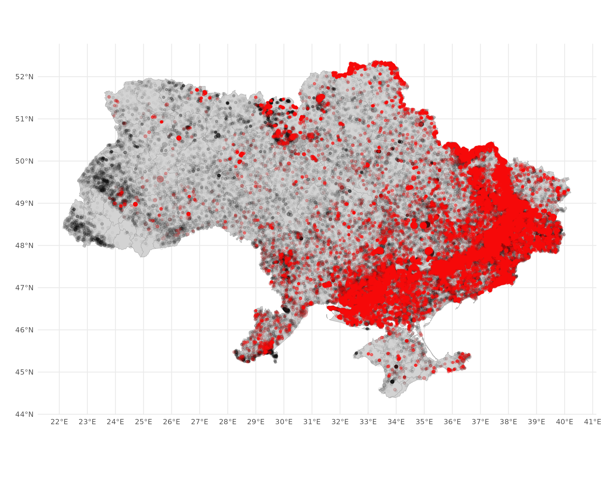
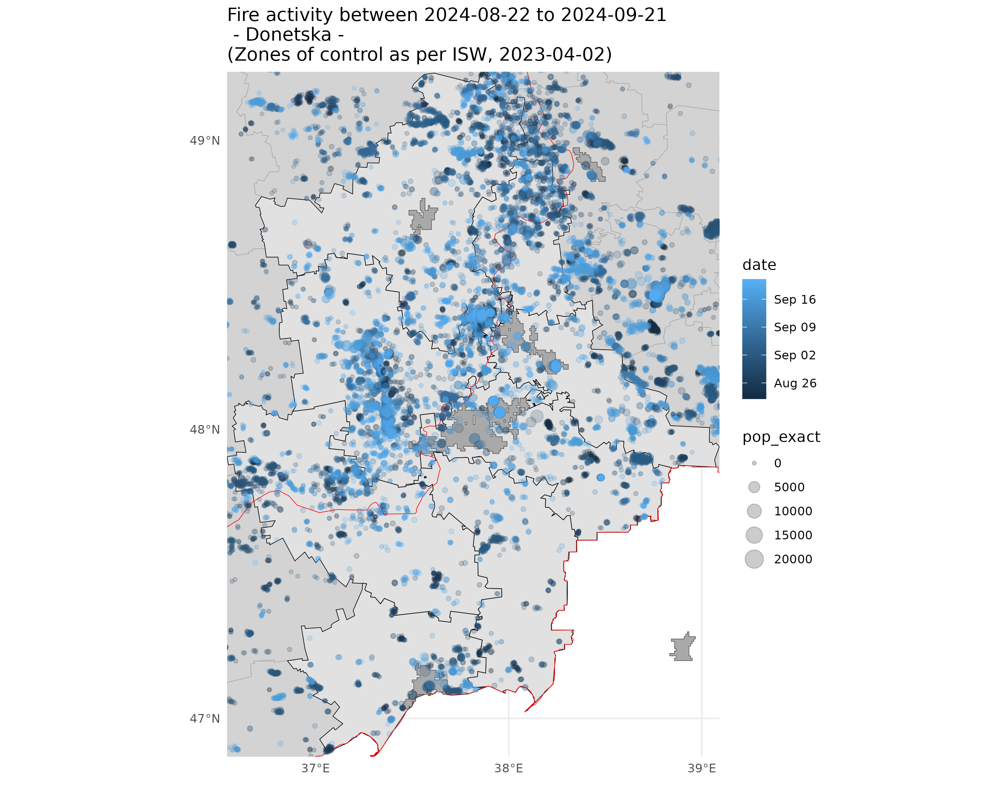
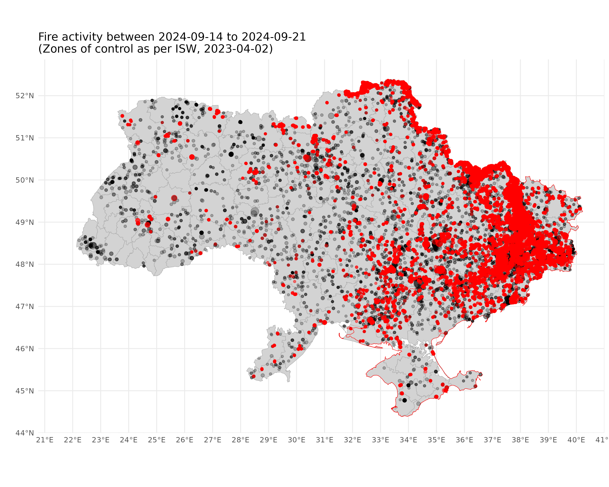

# *The Economist's* Ukraine war-fire model
This repository contains the source code and data associated with *The Economist’s* Ukraine war-fire model. This model uses statistical techniques from machine learning and satellite data on temperature anomalies to detect war events. Between February 24th, 2022, and February 18th, 2023, we detected 14,068 such events in the country. We have since added many more. 

In the following maps, red indicates that fires are classified as war-related. Size reflects approximate population density. 

### Events in the past week
  

### Events since Feb 24th, 2022
  

### Events day-by-day, since Feb 24th, 2022

### Spotlight: Donetsk
  
  

### Spotlight: Bakhmut
  
  
  
  

### Events in the past month
  

### Events in the past week
  

### Charts of events per day
  
  
  
  

## Scripts, sources and output data
Generating the model ensemble, as well as model outputs, maps, and analysis charts can be done by running the master script: 

* [`scripts/00-master-script.R`](00-master-script.R)

This script calls component scripts as well as auxiliary scripts. These produce, among other things, the following map, where each of the 14,068 dots is a fire event with a precise location (in most cases, to within 500m accuracy), a date, and a time of day.

  

To update the model, run:
* [`scripts/000-autoupdater.R`](000-autoupdater.R)

This automatically downloads the latest data, updates predictions, get exact population densities of events, runs the classifier to detect war activity, and updates all maps, charts, and animations.

## Classification of events

All details on the procedure used to classify events are available in the above scripts. In brief, events are classified as war-related if they met the following thresholds:
* Excess fire activity in a given 0.1 latitude by 0.1 longitude area of Ukraine on a given day is so large as to have less than 5% probability of occuring in a normal year.
* Such excess has happened regularly in that area of the country, defined as twice within a single cell less than 50km away, at least 7 days apart and less than 180 days apart (i.e. two spaced-out events within a six-month period).
* or: A fire event takes place in a cell less than 10 days after it has meet the above two requirements. (In other words, other activity producing fire events, typically from agriculture, does not resume until 10 days after an area has seen a war event.)

## Limitations
Many war events do not produce heat at a level detectable by the satellite systems we use, and even if they do, events may go unrecorded because they happen under cloud cover, which regularly obscures much of the country from such satellite monitoring, or have cooled by the time the satellites pass overhead. This means not all war events are detected. 

Moreover, our statistical method classifying events as war-related (or not war-related) is probabilistic. This means that it will sometimes categorise events which were unrelated to the war as war-related, and more frequently, given our strict thresholds, classify events related to the fighting as insufficiently abnormal to be labelled war-related. 

## Historical versions and sources
This model was first published on February 23th, 2023. 

## Acknowledgements
*The Economist* gratefully acknowledge helpful discussions with Daniel Arribas-Bel and Francisco Rowe of the University of Liverpool on the construction of training features and modelling approach.

If you have any suggestions or questions, please email [sondresolstad@economist.com](mailto:sondresolstad@economist.com) or open a ticket.

## Licence
This software is published by [*The Economist*](https://www.economist.com) under the [MIT licence](https://opensource.org/licenses/MIT). The data generated by *The Economist* are available under the [Creative Commons Attribution 4.0 International License](https://creativecommons.org/licenses/by/4.0/).

The data and files that we have generated from open sources are freely available for public use, as long as *The Economist* is cited as a source.

## Suggested citation
The Economist and Solstad, Sondre (corresponding author), 2023. The Economist war-fire model. First published in the article "A hail of destruction", The Economist, February 25th issue, 2023.
